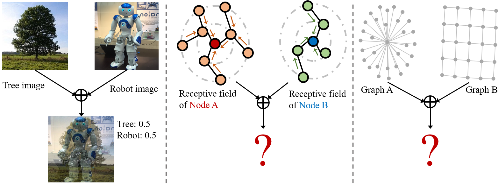
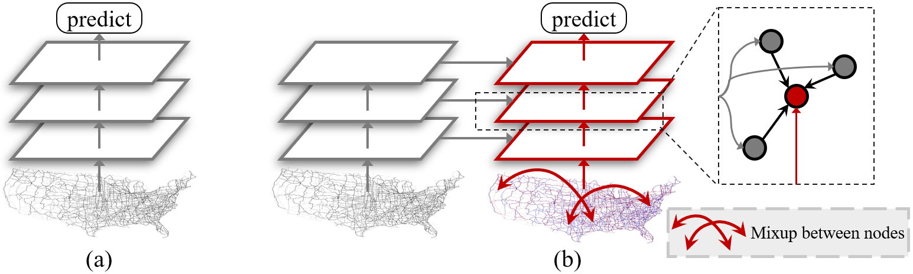

# Mixup for Node and Graph Classification [[draft](https://wangywust.github.io/Paper/2021mix.pdf)] 

Mixup for Node and Graph Classification|  
:-------------------------:|
  |


## Introduction

This is an implementation for the paper titled 'Mixup for Node and Graph Classification' based on torch_geometric. Mixup is an advanced data augmentation method for training neural network based image classifiers, which interpolates both features and labels of a pair of images to produce synthetic samples. However, devising the Mixup methods for graph learning is challenging due to the irregularity and connectivity of graph data. In this work, we propose the Mixup methods for two fundamental tasks in graph learning: node and graph classification. To interpolate the irregular graph topology, we propose the two-branch graph convolution to mix the receptive field subgraphs for the paired nodes. Mixup on different node pairs can interfere with the mixed features for each other due to the connectivity between nodes. To block this interference, we propose the two-stage Mixup framework, which uses each node's neighbors' representations before Mixup for graph convolutions. For graph classification, we interpolate complex and diverse graphs in the semantic space. Qualitatively, our Mixup methods enable GNNs to learn more discriminative features and reduce over-fitting. Quantitative results show that our method yields consistent gains in terms of test accuracy and F1-micro scores on standard datasets, for both node and graph classification. Overall, our method effectively regularizes popular graph neural networks for better generalization without increasing their time complexity.

#### Paper link: [Mixup for Node and Graph Classification](https://wangywust.github.io/Paper/2021mix.pdf)

Two-stage Mixup|  
:-------------------------:|
  |

## Running the experiments

### Requirements

Dependencies (with python == 3.8.2):

```{bash}
torch==1.8.1+cu102
torch_geometric==1.7.0
numpy==1.18.1
```

### Data Preparation
Just create a folder named 'data' on the same level with this repo's folder. Then the left things will be done by the code automatically.

### Model Training
```{bash}
# node classification with mixup
python mixup.py --mixup

# node classification without mixup
python mixup.py
```

## License
MIT